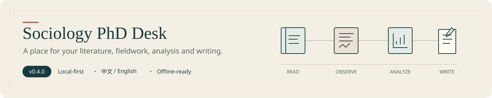
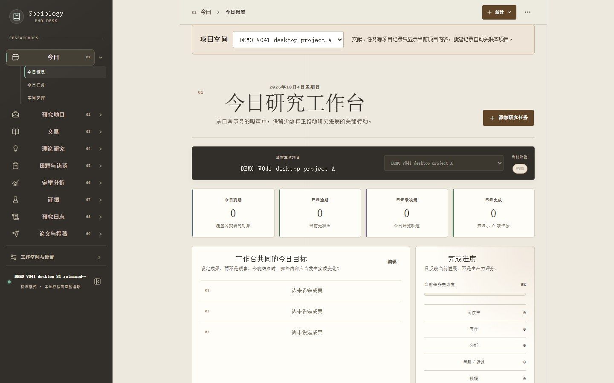
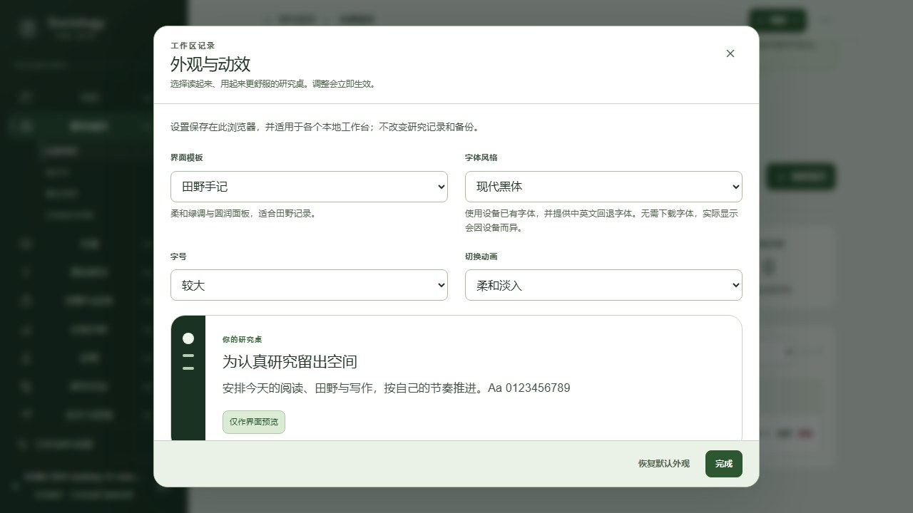
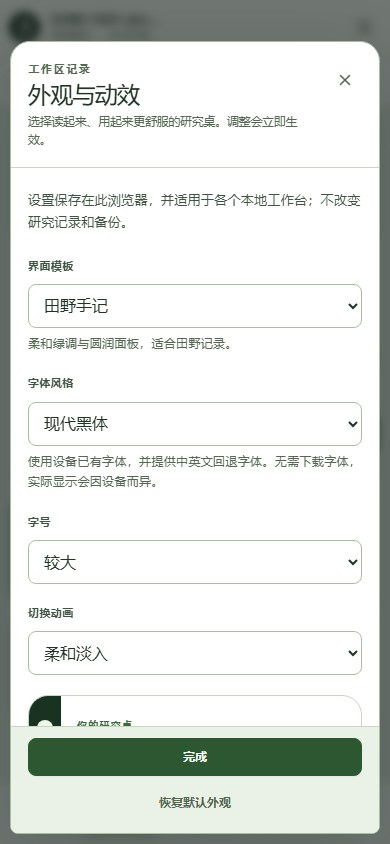
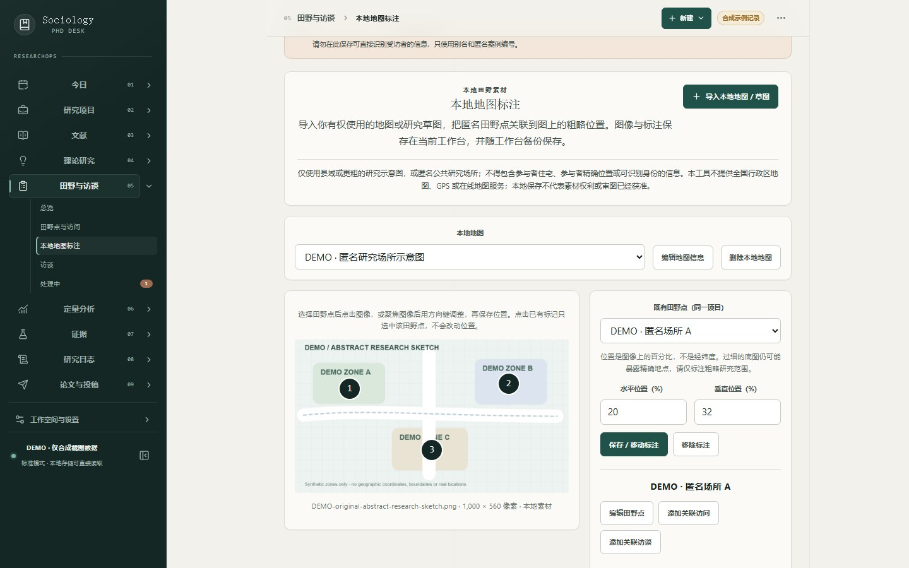
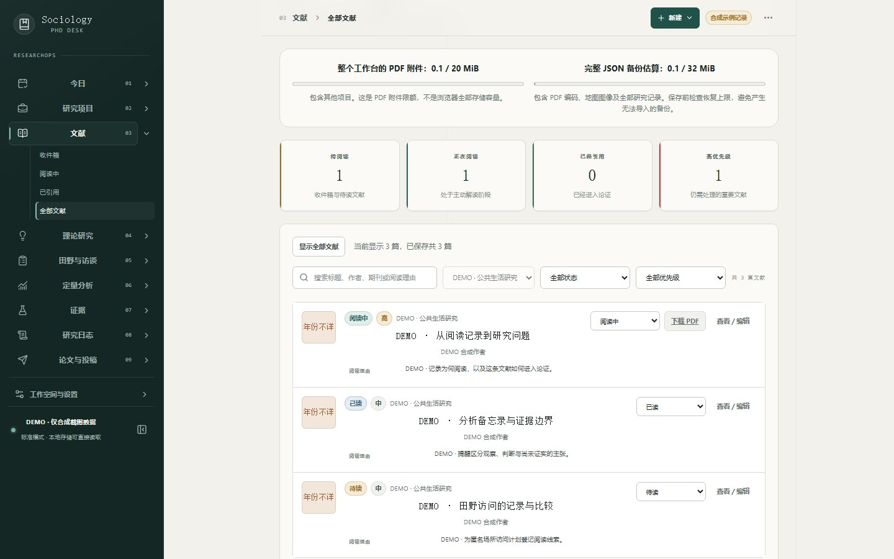
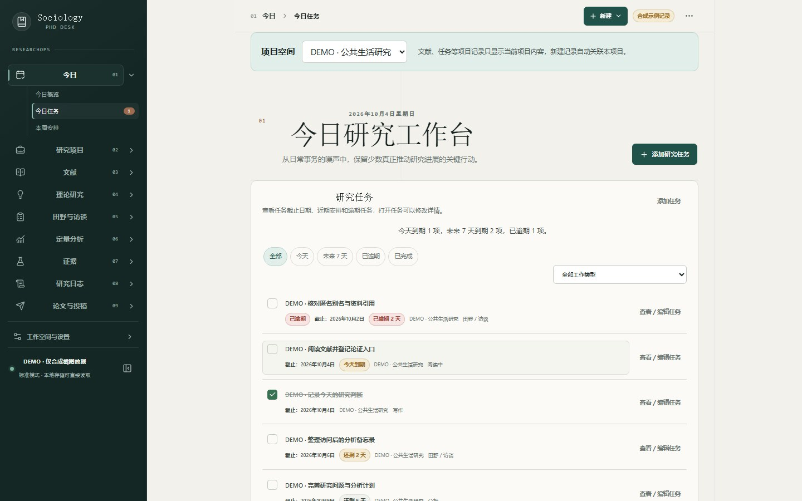
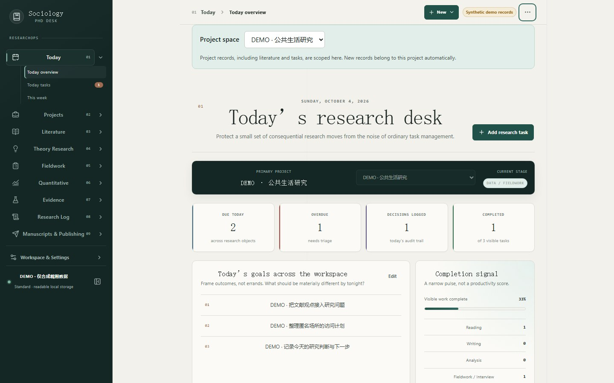
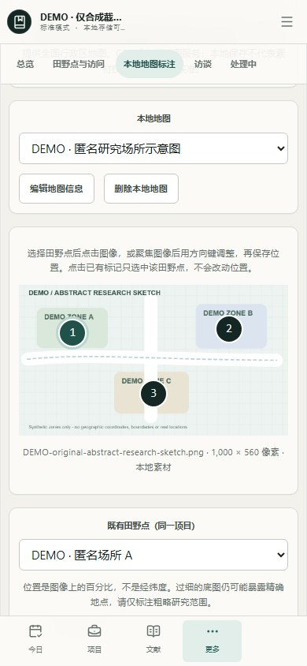

[简体中文](README.md) · **English**



# Sociology PhD Desk

**A research desk for literature, fieldwork, analysis and writing.**

A local-first workstation for sociology doctoral researchers. No account required. Chinese by default, with a complete English interface. Use your browser or install the PWA.

**[Open the desk →](https://yoesher.github.io/sociology-phd-desk/)** · **[Releases](https://github.com/Yoesher/sociology-phd-desk/releases)** · **[Get started](docs/en/getting-started.md)** · **[0.4.1 update notes](docs/releases/v0.4.1.md)**

`Current app 0.4.1` · `Data format v7` · `Local-first` · `Offline-capable`

**0.4.1 is live: Appearance & motion.** In Workspace & Settings, choose Classic research desk/Warm paper/Quiet blue/Field notebook templates; local Academic mix/Modern sans serif/Reading serif/System font; Standard/Large/Larger reading sizes; and Gentle lift/Soft fade/Light slide/No animation. Defaults retain the previous appearance, and system reduced motion takes priority. Preferences share this browser's settings with language/theme and follow standard/encrypted workspace switches, locks and reloads; they are excluded from research data and backups. Templates change colors/layout only and insert no research content. [Update and verification notes](docs/releases/v0.4.1.md)

[Local maps and backup guide](docs/local-field-maps-and-storage-2026-10-04.md) · [Changelog](CHANGELOG.md) · [Actual verification record](PROJECT_STATE.md)



*Captured from the running application with synthetic DEMO content only. No real papers, empirical findings or participant material.*

## Connect the work from reading to revision

| Work | What you can do now |
| --- | --- |
| **Literature and PDFs** | Register citations manually, view/edit records and attach local PDFs. PDF upload and Zotero metadata import have separate entry points. Successful saves show the full scoped list; failed saves retain input. |
| **Project spaces** | Select a project to display its records across research modules and assign new records automatically. Switching projects changes the display; writes and backups retain the full workspace. Daily goals remain workspace-wide. |
| **Tasks and dates** | See actual deadlines, remaining/overdue days and the next seven days; revisit dates and notes while keeping completion state. Open pages refresh local dates at midnight, focus and return to visibility. |
| **Local field annotations** | Import an entitled PNG/JPEG map or sketch and link same-project field sites by image percentages, with related visits/interviews. Use clicks, keyboard or percentage entry; removing a marker keeps original records. |
| **Private workspaces and backups** | Isolate multiple local workspaces, optionally use encrypted storage, lock and `.sociologydesk` encrypted backups. Both ordinary and encrypted backups include all projects, PDFs, images and markers. |

The app connects research questions, literature, datasets or interviews, analysis, evidence, claims, manuscripts and revision work; it complements specialist tools such as Zotero, Word, Stata, R, Python and NVivo. Complete explicit Evidence↔Claim↔Manuscript tracing remains separate [Issue #2](https://github.com/Yoesher/sociology-phd-desk/issues/2) work, and edit/delete support is not yet uniform across modules.

## Inside the desk

These new appearance controls are captured from the deployed 0.4.1 interface. Desktop and touch phone each remember preferences in their own browser. All captures use independent synthetic workspaces, with no access to real research data.

<table>
  <tr>
    <td width="70%" valign="top"><a href="docs/screenshots/v0.4.1/01-appearance-settings-zh.jpg"></a><br /><strong>Choose your research desk</strong><br />Four templates, four fonts, three reading sizes and four motion choices apply immediately and persist.</td>
    <td width="30%" valign="top"><a href="docs/screenshots/v0.4.1/03-mobile-settings-zh.jpg"></a><br /><strong>Adjust it on your phone</strong><br />Readable controls and system reduced-motion priority.</td>
  </tr>
</table>

Click an image to open it at full size. These are real 0.4.0 screens with synthetic demonstration records; the sketch contains no real geographic boundaries or participant locations. Version, dimensions and privacy review are in the [screenshot register](docs/screenshots/README.md).

<table>
  <tr>
    <td width="50%" valign="top">
      <a href="docs/screenshots/v0.4.0/03-field-maps-zh.jpg"></a><br />
      <strong>Local map annotations</strong><br />Link field sites and records on your own coarse material.
    </td>
    <td width="50%" valign="top">
      <a href="docs/screenshots/v0.4.0/02-literature-zh.jpg"></a><br />
      <strong>Literature and PDFs</strong><br />Register, view and edit; attachments enter complete backups.
    </td>
  </tr>
  <tr>
    <td width="50%" valign="top">
      <a href="docs/screenshots/v0.4.0/04-deadlines-zh.jpg"></a><br />
      <strong>Task deadlines</strong><br />Plan by actual dates and revisit task details.
    </td>
    <td width="50%" valign="top">
      <a href="docs/screenshots/v0.4.0/05-interface-en.jpg"></a><br />
      <strong>Complete English interface</strong><br />Language switching preserves research text and relationships.
    </td>
  </tr>
</table>

<details>
<summary>See the phone view · 390 × 844</summary>

<p>The phone capture also uses synthetic DEMO content only; click for the original.</p>
<a href="docs/screenshots/v0.4.0/06-mobile-zh.jpg"></a>

</details>

## Start in three steps

1. **Open the website and create a workspace.** No registration. Explore the synthetic demo, then create a standard or encrypted workspace. Ordinary browser access always supports the complete workflow.
2. **Select a project and register research records.** Start with literature, tasks or a field site. Local sketches are optional; visits/interviews still work without a map.
3. **Create and test a backup.** Restore a `.sociologydesk` backup into a new isolated workspace to move devices. PWA installation and local saving do not create a second copy automatically.

After a successful first load and caching, the app's static resources can start offline. When an update appears, **Later** retains the current version. Save edits and create/test a backup before choosing **Update now**, then check the application version and build identity in Help. Do not clear site data or reset a workspace to update. There are no closed-page system notifications or background deadline pushes.

## Attachment limits and migration

| Content | Current boundary |
| --- | --- |
| Local PDFs | **10 MiB** each / **20 MiB** per full workspace; decoded when downloading. |
| PNG/JPEG images | **2 MiB** each / **4 MiB** per full workspace; at most **8,192 pixels per edge / 16 million pixels**. |
| Complete ordinary JSON | **32 MiB**, including every project, record and base64 attachment; ordinary file import checks this limit before reading. |
| Encrypted backup | Existing **64 MiB ciphertext** ceiling and independent attachment limits; authentication tags/wrappers have additional bounds. Capacity is not unlimited. |

1 MiB = 1,048,576 bytes. Base64 and readable JSON add overhead, so complete ordinary JSON may exceed its limit before separate attachment maxima. Export and new over-budget growth fail explicitly, retaining input and committed data; attachments are never truncated and backups are never limited to the current project.

Existing valid over-budget workspaces remain readable/migratable and permit writes that do not increase serialized size. Complete encrypted preservation remains available within the original encryption and attachment bounds. More substantial PDF support requires independent attachment storage and chunked authenticated backup, neither implemented yet; keep your original files.

Current portable workspace, standard database and authenticated encrypted payload are **v7**; container, vault database and registry database remain **v1**. v6 → v7 keeps records and adds only an empty local-map collection, without inventing images or coordinates. The older 0.3.1 app cannot read v7 backups; keep/test an original-version backup before moving versions. Review import previews; replacement requires explicit confirmation. Encrypted restore authenticates and validates before creating a new isolated workspace; wrong passwords or damaged ciphertext write no destination.

See the [local-map/storage guide with English brief](docs/local-field-maps-and-storage-2026-10-04.md) and [data portability](docs/data-portability.md).

## Local-first, with research privacy in view

**Do not store directly identifying participant information.** Use aliases and anonymous IDs; exclude names, phone numbers, identity-document numbers, precise addresses, signatures and complete consent forms.

- Research data stays in IndexedDB for the current browser profile by default, without accounts, default cloud sync, analytics, third-party trackers or a required AI API. Separate workspaces have separate databases but share one Web-origin trust boundary.
- Standard workspaces and ordinary JSON are plaintext. Only explicitly encrypted workspaces or `.sociologydesk` backups use application-layer encryption; an interface lock is not encryption. Registry names/times/modes and approximate storage size remain visible.
- Dataset, script and output paths are references, not file ingestion; selected PDFs/images store actual bytes. This is not a secure vault for source datasets, full transcripts or irreplaceable material.
- Local images must be entitled county-level-or-coarser research sketches or anonymous public settings, without participant homes, exact locations or identifiers. Original bytes and possible **EXIF/GPS are not automatically stripped**; percentages and aliases do not guarantee anonymity, rights or map-review compliance.
- No national basemap, province/city/county browsing, administrative catalog, online tiles, external map API, GPS acquisition or public image export. All four national-map gates remain **BLOCKED**; local materials do not complete or bypass them. The app does not automatically upload materials, markers or research records.

Browser storage can be cleared and devices can fail. Encryption cannot protect an unlocked session or compromised device; forgotten passwords and lost backups can make data unrecoverable. IndexedDB deletion is not secure erasure. Maintain/test independent backups and follow institutional ethics, consent, retention and data-protection requirements. No real-user database has been inspected, so recovery of previously unseen literature is not claimed.

[Security](SECURITY.md) · [Privacy and encryption model](docs/en/privacy-model.md) · [Research ethics](docs/research-workflows/research-ethics.md)

## Zotero keeps its bibliographic role

Zotero remains authoritative for bibliography, PDFs, notes, annotations and citations. Select items in Zotero 8/9 and send them to the desk, then review the import preview, project, reading status and priority before confirming writes.

Plugin **0.1.0 transfers allowlisted bibliographic metadata only**, without reading/importing PDFs, attachments, private notes, annotations, full text, accounts or sync information. Local PDFs are selected independently in the desk; there is no automatic PDF metadata extraction.

**[Download plugin 0.1.0](https://github.com/Yoesher/sociology-phd-desk/releases/download/v0.3.0/sociology-phd-desk-zotero-0.1.0.xpi)** · [SHA-256 checksum](https://github.com/Yoesher/sociology-phd-desk/releases/download/v0.3.0/sociology-phd-desk-zotero-0.1.0.sha256) · [Installation and use](docs/en/zotero-integration.md)

The plugin keeps its existing formal v0.3.0 assets; this application update is not a new plugin release.

## Nine research domains, one lifecycle

| Domain | Purpose |
| --- | --- |
| Today / Research projects | Shared goals, tasks, research questions, methods and project progress. |
| Literature / Theory research | Reading relevance, PDFs, concepts, mechanisms and theory memos linked to same-project questions, claims and literature. |
| Fieldwork / Quantitative analysis | Aliased sites, visits, interviews and optional sketches; datasets and Stata/R/Python analysis runs. |
| Evidence / Research log | Source locators, findings, limitations and support judgments; research decisions and next steps. |
| Manuscripts and publishing | Writing stages, submissions, reviewer comments, responses and revision actions, retaining entities and history. |

React, TypeScript and Vite render the interface; Dexie manages IndexedDB, Zod validates portable data and Web Crypto supplies optional authenticated encryption. Language preferences are separate from research workspaces; switching Chinese/English never rewrites titles, notes or other user text. No accounts, cloud sync, general AI assistant or map service.

[Architecture](docs/architecture/overview.md) · [Data model](docs/architecture/data-model.md) · [Decisions](DECISIONS.md) · [Roadmap](ROADMAP.md)

## Development and contribution

**Node.js 24 / npm 11** are the verified development environment. Use a modern browser with IndexedDB; actual browser coverage and version acceptance belong in [PROJECT_STATE.md](PROJECT_STATE.md).

```bash
git clone https://github.com/Yoesher/sociology-phd-desk.git
cd sociology-phd-desk
npm ci
npm run dev
```

Open Vite's local URL. Browser profiles/devices do not automatically share records. The full release gate uses these original commands; Playwright requires the corresponding Chromium browser runtime.

```bash
npm ci
npm run audit:release
npm run lint
npm run typecheck
npm test
npm run test:zotero
npm run build
npm run test:e2e
```

Report only checks that actually passed on the current revision. Zotero builds may generate a hash file; review generated changes rather than treating a locally repackaged hash as the checksum of an existing formal download asset.

[Contributing](CONTRIBUTING.en.md) · [Code of conduct](CODE_OF_CONDUCT.md) · [Researcher feedback form](https://github.com/Yoesher/sociology-phd-desk/issues/new?template=researcher_testing_feedback.yml)

Attach synthetic or fully redacted material only, without participant information, private fieldnotes, transcripts, credentials or proprietary data. Project activity/adoption is reported only when verified; maintainer tests, public availability or Stars do not establish external researcher adoption. See the [integrity register](docs/codex-for-oss.md) and [maintainer record](MAINTAINERS.md).

## Citation and license

If you use this software in research, cite **Sociology PhD Desk and the exact application version used**; machine-readable details are in [CITATION.cff](CITATION.cff). Release records and historical changes are in [Releases](https://github.com/Yoesher/sociology-phd-desk/releases) and [CHANGELOG.md](CHANGELOG.md).

Sociology PhD Desk is available under the [MIT License](LICENSE).
