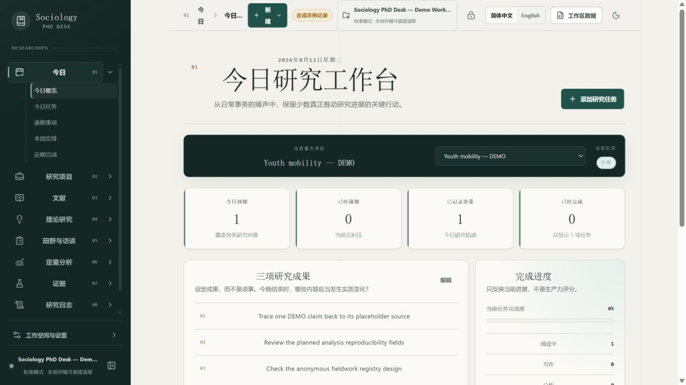
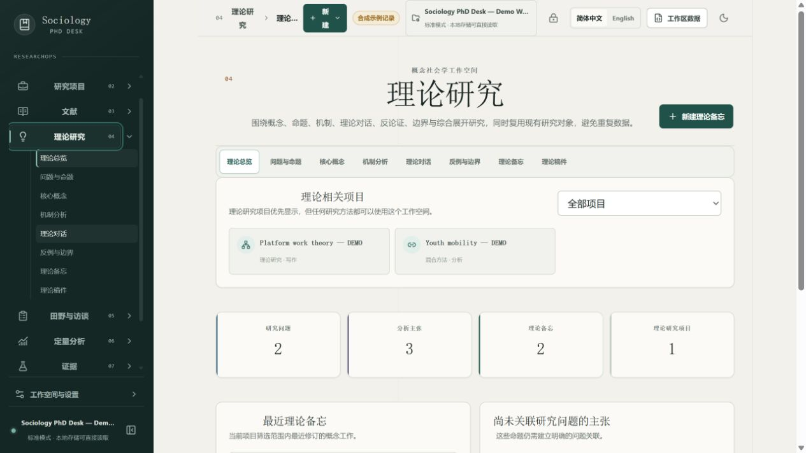
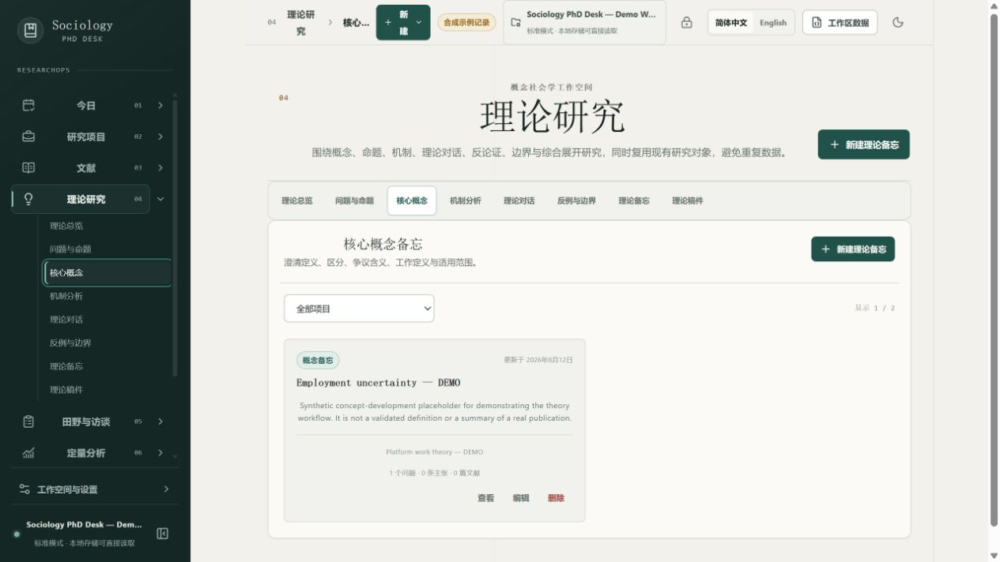
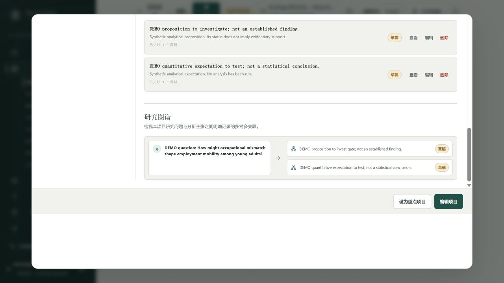
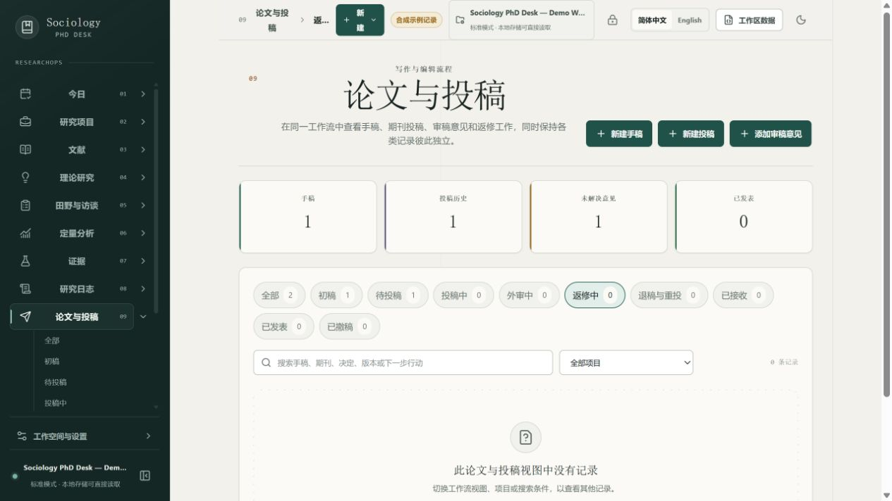
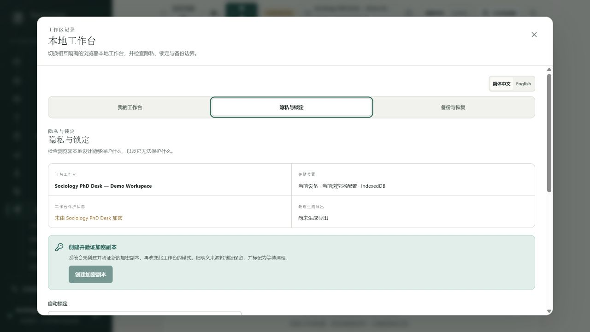
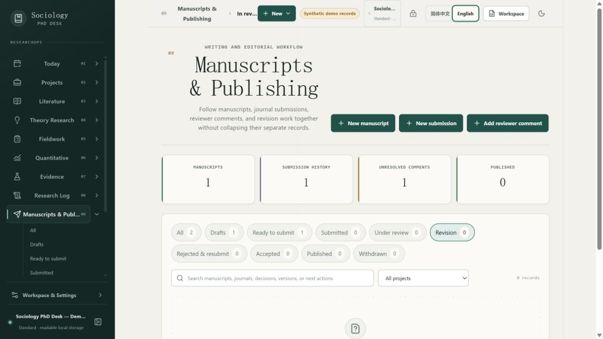

**简体中文** | [English](README.en.md) · [路线图](ROADMAP.md) · [贡献指南](CONTRIBUTING.md) · [项目状态](PROJECT_STATE.md)

# Sociology PhD Desk / 社会学博士研究工作站

**面向社会学博士研究者的本地优先 ResearchOps 工作站。**

在同一条研究生命周期中管理文献、田野、定量分析、证据、论文与同行评审后的修回工作。

## 立即开始

**直接使用网页版：** [https://yoesher.github.io/sociology-phd-desk/](https://yoesher.github.io/sociology-phd-desk/)

- **无需注册或 GitHub 知识：** 打开链接即可建立本地工作台；不需要账号、云数据库或默认同步。
- **数据默认在本地：** 研究记录保存在当前设备与浏览器配置文件的 IndexedDB 中。请定期生成并验证加密备份。
- **想安装就安装：** 兼容浏览器会提供 PWA 安装入口；普通浏览器访问仍然是一等使用方式。
- **跨平台浏览器可用：** Windows、macOS、Linux 上支持 IndexedDB 的现代浏览器均可直接访问。
- **换设备靠加密备份：** 使用 `.sociologydesk` 文件在新设备恢复为隔离工作台，不需要 GitHub。

完整步骤见[中文开始使用指南](docs/zh-CN/getting-started.md)。

> **[`v0.2.1`](https://github.com/Yoesher/sociology-phd-desk/releases/tag/v0.2.1) 分发与 PWA 已正式发布：** 可以直接使用网页版，也可以从支持 PWA 的浏览器安装；应用静态资源可离线启动，更新由用户确认并在工作区安全写入完成后激活。Release PR [#25](https://github.com/Yoesher/sociology-phd-desk/pull/25) 通过精确 head CI 与 P0 = 0 / P1 = 0 自审后合并，annotated tag 与 latest、非草稿、非预发布 GitHub Release 均指向精确发布 SHA [`8db828f`](https://github.com/Yoesher/sociology-phd-desk/commit/8db828faaa94f7591dbd806abe90916335862187)。

> **[`v0.2.0`](https://github.com/Yoesher/sociology-phd-desk/releases/tag/v0.2.0) 已正式发布：** 九个研究工作域的二级导航、理论研究、研究问题—主张图谱、本地私密/加密工作区，以及论文与投稿整合均已发布。Release PR [#21](https://github.com/Yoesher/sociology-phd-desk/pull/21) 通过精确 head CI 与 P0 = 0 / P1 = 0 审查后合并；精确发布 SHA [`eb399f7`](https://github.com/Yoesher/sociology-phd-desk/commit/eb399f7da0a1f3142f7c8361492fa86b08db77db) 的 CI 与 Pages 均通过，annotated tag 与 latest、非草稿、非预发布 GitHub Release 均指向该版本。中国研究地图因来源、再分发、审图元数据和全国完整性门禁均未通过而暂缓，**不属于 `v0.2.0`**。核验证据与限制见 [PROJECT_STATE.md](PROJECT_STATE.md)。

项目尚未经过外部研究者测试。请勿把不可替代的研究材料只保存在本软件中；公开可用、获得 Star 或通过维护者自测都不等于真实采用。

## 为什么需要 Sociology PhD Desk？

社会学研究不只是任务管理。

一个项目往往同时包含文献、访谈、田野笔记、数据集、模型、分析备忘录、论文和审稿意见。通用工具通常分别管理文件、笔记或任务。Sociology PhD Desk 尝试把研究对象与研究决策连接成一条可追溯的工作流：

```text
研究问题
  → 文献
  → 数据集 / 访谈
  → 分析
  → 证据
  → 主张
  → 论文
  → 投稿
  → 审稿意见
  → 修回
```

它是一层研究编排工具，而不是 Zotero、Word、Stata、R、Python、NVivo、MAXQDA 或期刊投稿系统的替代品。

## `v0.2.0` 发布范围

工作站围绕九个稳定的社会学研究工作域组织：

- **今日工作台**：研究目标、关联项目的任务、逾期事项与简明的当日研究日志。
- **研究项目**：研究问题、方法、阶段、日期和关联研究活动。
- **文献队列**：记录为什么要读、文献如何进入论证；参考文献库仍由 Zotero 管理。
- **理论研究**：管理概念、机制、理论对话、反论证、边界条件与综合 memo，并显式关联同一项目的研究问题、主张和文献。
- **田野与访谈**：用别名和匿名 ID 管理田野点、田野访问与访谈。
- **定量分析**：登记数据集，以及 Stata、R、Python 和其他工具的分析运行。
- **证据台账**：连接主张、来源定位、发现、局限、支持程度和论文位置。
- **研究日志**：记录研究变化、判断、问题和下一步，形成可审计轨迹。
- **论文与投稿**：在统一界面中跟踪写作阶段、期刊投稿、审稿意见、回复与修回行动，同时保留各实体及其历史。
- **可迁移工作区数据**：经过验证的 JSON 导入与导出，不静默替换已有数据。
- **演示工作区**：只使用明确标注的合成记录来说明产品，不伪装真实论文、结果或访谈材料。

产品优先服务桌面研究，支持响应式布局、明暗主题和离线友好使用；核心工作流不要求账号或应用服务器。`v0.2.0` 还带来：

- 中文优先、完整英语替代界面；语言切换不改写用户研究文本或可迁移数据；
- 一等 `ResearchQuestion`、`Claim` 与显式项目内关系，以及可视化研究图谱；
- `TheoryMemo` 的完整中英文 CRUD、同项目关系保护和仅作界面引导的结构化提示；
- 普通与加密本地工作区、锁定与 `.sociologydesk` 加密备份；普通 IndexedDB 与 JSON 导出仍为明文；
- 至多两层、URL 可寻址且不改动数据的 Smart View，以及桌面/移动端一致的九域导航；
- portable workspace 与标准 IndexedDB v4；v3 → v4 只增加空 `theoryMemos`，不推断或改写研究内容。

完整功能、迁移、安全边界与精确门禁证据见 [PROJECT_STATE.md](PROJECT_STATE.md)、[数据迁移说明](docs/data-portability.md)和[隐私与加密模型](docs/zh-CN/privacy-model.md)。Issue [#2](https://github.com/Yoesher/sociology-phd-desk/issues/2) 的 Evidence↔Claim↔Manuscript 显式追踪仍未实现；各对象的完整编辑/删除能力也不完全一致。

## 为什么是社会学专用？

产品首先服务于社会学博士研究者，包括定量、质性、混合方法和理论研究，以及人口、劳动、家庭、组织与青年研究等领域。相邻经验学科的研究者也可能受益，但产品不会为了泛化而放弃社会学身份。

每个新功能都应回答：**它是否解决了社会学研究工作流中的特有问题？** 社交网络、聊天、通用笔记编辑器、参考文献数据库和大型通用 AI 助手不在当前范围内。

## 语言与数据边界

- 本文件是默认中文入口；[README.en.md](README.en.md) 提供完整英文版本。
- 产品方向是简体中文优先并提供完整英语界面。每项实质性界面功能必须同步维护中英文文案；实际交付状态以 [PROJECT_STATE.md](PROJECT_STATE.md) 为准。
- 界面语言偏好与研究工作区分开保存；架构中的枚举、标识符和可迁移 JSON 保持语言中立。
- 切换语言只改变应用界面、系统消息以及日期和数字的显示，不会静默翻译或改写用户输入的标题、笔记、引文、田野材料或其他研究内容。

## 本地优先与隐私

- 核心研究记录通过 IndexedDB 保存在浏览器本地；不同工作台使用独立物理数据库，但仍处于同一 Web 来源的信任边界内。
- 不要求账号、默认云同步、分析统计或第三方跟踪器。
- 本地文件字段只是引用；本应用不是源数据或访谈文本的安全保管库。
- 标准工作台及其普通 JSON 导出是明文；只有明确标为加密工作台或 `.sociologydesk` 加密备份的内容使用应用层加密。
- 工作台名称、时间、模式、自动锁定和不透明存储定位信息保留在明文注册表中；加密不隐藏数据库或备份的大致大小。
- AI 不是核心依赖。未来任何 AI 建议都必须与来源证据清晰区分。

本地优先并不等于没有风险。浏览器存储可能被清除，设备可能损坏，已经解锁的工作台可能被同源恶意代码或失陷设备读取，普通 JSON 也可能包含敏感笔记。界面锁定不是加密；删除 IndexedDB 也不是可验证的安全擦除。请维护并实际测试合适的备份，并遵守所在机构的研究伦理、知情同意、保留期限与数据保护要求。

在录入田野或访谈元数据前，请阅读[安全政策](SECURITY.md)、[隐私与加密模型](docs/zh-CN/privacy-model.md)和[研究伦理指南](docs/research-workflows/research-ethics.md)。

## 截图

以下 `v0.2.0` 发布截图均在发布候选阶段采集自 1280 像素宽的实际应用，只显示明确标注的合成 Demo。采集与隐私检查详见[截图登记](docs/screenshots/README.md)。
















## 开发者本地运行与贡献

### 环境要求

- 已验证的开发环境为 Node.js 24 和 npm 11。
- 启用 IndexedDB 的当前版本 Chromium、Firefox 或 Safari 桌面浏览器。

### 本地运行

在已有代码检出目录中运行：

```bash
npm ci
npm run dev
```

公开仓库为 [Yoesher/sociology-phd-desk](https://github.com/Yoesher/sociology-phd-desk)。新检出可使用：

```bash
git clone https://github.com/Yoesher/sociology-phd-desk.git
cd sociology-phd-desk
```

打开 Vite 在终端中显示的本地地址。同一浏览器配置文件中的数据不会自动出现在其他配置文件或设备上。

### 验证贡献

```bash
npm run lint
npm run typecheck
npm test
npm run build
```

CI 也执行这组命令。只有在当前修订上实际成功运行后，才能把命令报告为通过。

### 备份或迁移工作区

普通 JSON 导出是可检查、可迁移的明文 portable workspace；请把它视为其中最敏感记录，并在分享前检查目标文件。导入时请核对预览并选择预期的合并方式。替换必须是明确操作，绝不能静默发生。

`v0.2.0` 导出 portable v4，并继续接受受支持的 v1、v2、v3 文件，通过显式 v1 → v2 → v3 → v4 转换后再执行同一套严格验证；v3 → v4 只创建空 `theoryMemos` 集合。迁移细节与研究图谱边界见[数据迁移说明](docs/data-portability.md)。

Phase 3C 为加密工作台增加 `.sociologydesk` 加密备份。它是独立的 container v1 格式，而不是换扩展名的普通 JSON；恢复时先认证和验证完整备份，再用新的逻辑工作台 ID 创建独立工作台。口令错误或密文损坏不会写入目标工作台。格式与失败边界见[数据迁移说明](docs/data-portability.md)和[隐私与加密模型](docs/zh-CN/privacy-model.md)。

## 架构

当前基础采用 React、TypeScript 和 Vite。Dexie 提供 IndexedDB 数据层，Zod 验证可迁移数据，Vitest 覆盖可测试的应用逻辑。持久化、领域逻辑和页面组件保持分离。研究图谱增加稳定 ID 的研究问题、主张与显式关系；本地工作区层增加元数据注册表、每工作区数据库适配器、会话门与 Web Crypto 加密库；Theory 增加 `TheoryMemo`。portable/standard 为 v4，container/vault/registry 分别保持 v1。

参阅[架构概览](docs/architecture/overview.md)、[数据模型](docs/architecture/data-model.md)和[架构决策](DECISIONS.md)。

## 路线图

`0.1` 系列建立核心研究生命周期、安全导入导出、质量门禁和公开维护基础。`v0.2.0` 已发布简中优先双语基础、研究问题—主张图谱、本地私密/加密工作区、Theory Research、二级导航，以及论文与投稿整合；本轮在发布后文档收尾处停止，不启动 `v0.3.0`。中国研究地图因公开地图来源、再分发与审图条件未形成可验证闭环而暂缓，不属于 `v0.2.0`；未来只有在合规条件变化并重新核验后才会恢复。

详见 [ROADMAP.md](ROADMAP.md)。路线图描述方向，不是交付承诺。

## 参与贡献

欢迎研究者、研究软件工程师、设计师和文档贡献者参与。最有帮助的报告会描述当前模型无法表示的具体研究对象或工作流转折。

- 阅读[中文贡献指南](CONTRIBUTING.md)和[行为准则](CODE_OF_CONDUCT.md)。
- 使用最适合问题的缺陷、功能或研究工作流 Issue 表单。
- 切勿附上可识别参与者信息、私人田野笔记、访谈文本、凭据或专有研究数据。
- 打开 Pull Request 前运行 lint、类型检查、测试和生产构建。

## 研究伦理

**请勿在此存储可直接识别参与者身份的信息。** 请使用别名以及 `participant_id`、`case_id`、`interview_id` 等匿名标识符。不要录入姓名、电话号码、政府证件号码、精确住址、签名或完整知情同意书。

Sociology PhD Desk 是工作流工具，不是伦理审查、知情同意管理、去标识化或机构知识库系统。可选应用层加密不构成机构批准、法律合规或对已失陷设备的绝对保护；研究者仍须对合法且合乎伦理的使用负责。

## 项目诚信

项目活动、用户、Star、Fork、下载量、Issue、Pull Request、Release 与外部采用情况，只在能够核验时报告。当前证据登记维护在 [docs/codex-for-oss.md](docs/codex-for-oss.md)。项目不会自动申请任何外部计划。

## 许可证

Sociology PhD Desk 使用 [MIT License](LICENSE)。
