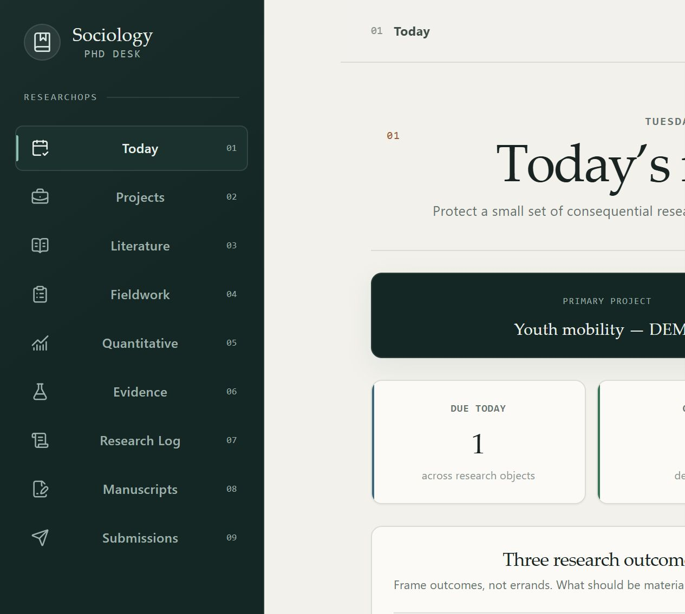
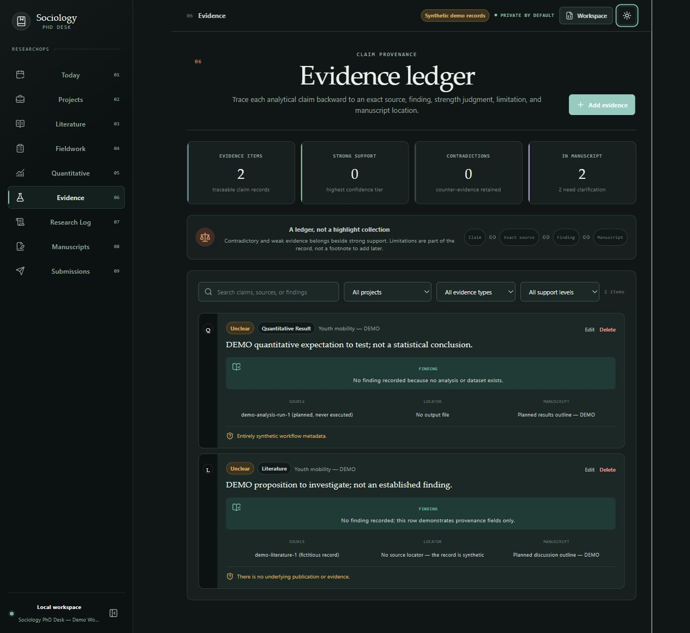
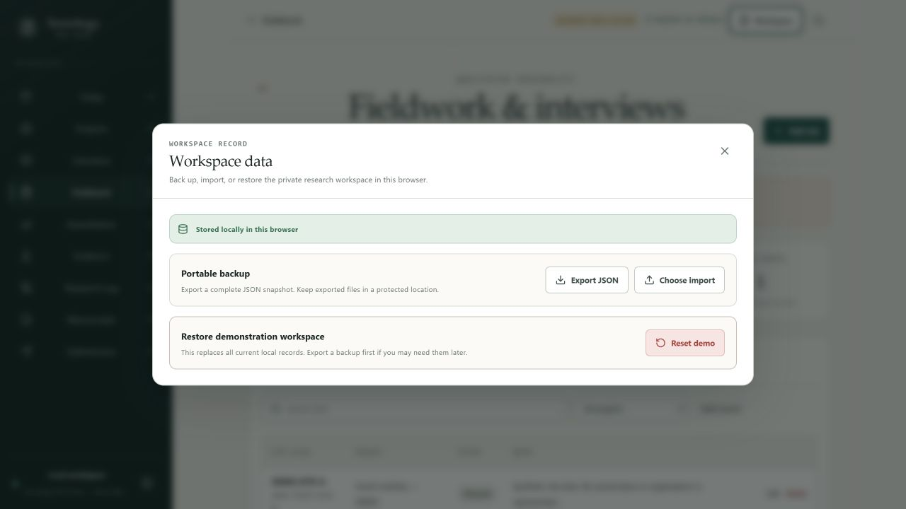

**简体中文** | [English](README.en.md) · [路线图](ROADMAP.md) · [贡献指南](CONTRIBUTING.md) · [项目状态](PROJECT_STATE.md)

# Sociology PhD Desk / 社会学博士研究工作站

**面向社会学博士研究者的本地优先 ResearchOps 工作站。**

在同一条研究生命周期中管理文献、田野、定量分析、证据、论文与同行评审后的修回工作。

**在线演示：** [https://yoesher.github.io/sociology-phd-desk/](https://yoesher.github.io/sociology-phd-desk/)

> **早期公开软件：** 当前正式 Release 仍是 `v0.1.0`；`main` 与在线演示还包含已经合并但尚未发布的 Phase 3A / 3B 功能。Phase 3C 本地私密工作空间目前只存在于未合并的候选分支，尚未通过 Pull Request、CI、`main` 与 Pages 门禁，也尚未进入公开演示。核验证据与限制记录在 [PROJECT_STATE.md](PROJECT_STATE.md)。项目尚未经过外部研究者测试。请勿把不可替代的研究材料只保存在本软件中；公开可用或获得 Star 不代表已经获得真实采用。

## 为什么需要 Sociology PhD Desk？

社会学研究不只是任务管理。

一个项目往往同时包含文献、访谈、田野笔记、数据集、模型、分析备忘录、论文和审稿意见。通用工具通常分别管理文件、笔记或任务。Sociology PhD Desk 尝试把研究对象与研究决策连接成一条可追溯的工作流：

```text
研究问题
  → 文献
  → 数据集 / 访谈
  → 分析
  → 证据
  → 主张
  → 论文
  → 投稿
  → 审稿意见
  → 修回
```

它是一层研究编排工具，而不是 Zotero、Word、Stata、R、Python、NVivo、MAXQDA 或期刊投稿系统的替代品。

## 功能

`0.1.x` 工作站围绕社会学研究对象组织：

- **今日工作台**：研究目标、关联项目的任务、逾期事项与简明的当日研究日志。
- **研究项目**：研究问题、方法、阶段、日期和关联研究活动。
- **文献队列**：记录为什么要读、文献如何进入论证；参考文献库仍由 Zotero 管理。
- **田野与访谈**：用别名和匿名 ID 管理田野点、田野访问与访谈。
- **定量分析**：登记数据集，以及 Stata、R、Python 和其他工具的分析运行。
- **证据台账**：连接主张、来源定位、发现、局限、支持程度和论文位置。
- **研究日志**：记录研究变化、判断、问题和下一步，形成可审计轨迹。
- **论文与投稿**：跟踪写作阶段、期刊投稿、审稿意见、回复与修回行动。
- **可迁移工作区数据**：经过验证的 JSON 导入与导出，不静默替换已有数据。
- **演示工作区**：只使用明确标注的合成记录来说明产品，不伪装真实论文、结果或访谈材料。

产品优先服务桌面研究，支持响应式布局、明暗主题和离线友好使用；核心工作流不要求账号或应用服务器。

在 `0.1.0` 中，研究项目、证据台账与田野模块提供创建、查看、编辑和受保护删除流程；文献、定量分析、研究日志、论文、投稿与今日工作台提供聚焦的登记、新增、筛选和状态工作流。让每一种对象都具备完整编辑与删除能力属于后续工作。

### Phase 3B 已合并（尚未发布）

Phase 3B 已通过 [PR #11](https://github.com/Yoesher/sociology-phd-desk/pull/11) 合并到 `main`，把研究问题和分析主张提升为项目内的一等研究对象：

- `ResearchQuestion`、`Claim` 与 `ClaimQuestionLink` 使用稳定 ID；文本不是外键。
- 研究问题与分析主张通过显式的项目内多对多关系连接，缺失端点、跨项目关系与重复关系会被拒绝。
- 项目详情提供完整中英文的研究问题、分析主张与研究图谱界面，可创建、查看、编辑、连接和删除未被引用的对象。
- 删除研究问题或主张前必须先明确移除其关系；删除项目也不会静默级联删除这些研究记录。
- 已合并实现把 IndexedDB 与 portable workspace 升级到 v3，并显式执行 v1 → v2 → v3 迁移。旧 `Project.researchQuestion` 迁移为研究问题；旧 `Evidence.claim` 原文继续保留，并只在同一项目内按 exact-trimmed 文本确定性生成主张。
- 迁移不会执行语义或模糊合并、自动改写，也不会推断某个主张回答哪个研究问题。

这不是新版本发布声明：Phase 3B 已合并并部署，但仍属于 `Unreleased`，正式 Release 与包版本仍是 `v0.1.0` / `0.1.0`。Issue [#2](https://github.com/Yoesher/sociology-phd-desk/issues/2) 仍为 OPEN；Evidence↔Claim 显式关系不属于 Phase 3B，当前 v3 没有新增 evidence `claimId`。公开 URL 已返回 HTTP 200，且部署资产名称/哈希与最终本地构建一致；由于浏览器控制当时返回 `instances=[]`，没有执行真实公共页面交互 smoke，不能把该项写成 PASS。完整证据见 [PROJECT_STATE.md](PROJECT_STATE.md)。

### Phase 3C 本地候选（尚未合并或发布）

Issue [#13](https://github.com/Yoesher/sociology-phd-desk/issues/13) 的本地候选把一个模糊的单一数据库改为显式的本地工作台注册表和彼此独立的物理数据库。它不是用户登录系统，也不创建网络账号：

- 普通个人工作台与明确标注的合成演示工作台分别存储；一个工作台内的实体不能引用另一个工作台的实体。并发的首次启动会收敛到同一组确定性初始路由，而不是各自创建重复工作台。
- **标准本地工作台**把可查询的研究表以明文结构保存在 IndexedDB。界面锁定只隐藏应用界面，不会加密这些表。
- **加密本地工作台**使用浏览器 Web Crypto 的 PBKDF2-HMAC-SHA-256 与 AES-256-GCM，把完整 portable v3 工作台保存为经过认证的密文；口令和派生密钥不持久化，重新加载或锁定后需要再次解锁。
- 注册表为了本地选择和恢复会明文保存工作台显示名称、时间、模式、自动锁定设置、迁移状态与不透明存储定位符；它不保存研究正文、口令、派生密钥或内容校验值。注册表显示名称是当前规范名称；导出时只把它复制到生成的 JSON 或加密备份载荷，不重写活动研究数据，也不增加工作台数据修订号。
- 普通 JSON 导出仍是**明文** portable v3 文件。加密备份使用不同的、版本化的 `.sociologydesk` 容器；container v1 与 portable v3、普通数据库 v3、注册表数据库 v1、加密库数据库 v1 是独立版本轴。
- 旧单一数据库的迁移和标准工作台转加密都采用非破坏性的分阶段流程。只有完全未改动的合成夹具会继续归类为演示；被编辑过的旧演示会迁移为个人工作台，并另建一个纯净演示工作台。
- 转换在创建加密库前先持久保留目标定位符。若中断后目标加密库仍存在，继续转换或丢弃该目标都必须用口令认证并核对工作台身份；只有已确认目标不存在时，才可无口令清除空预留。加密路由发布后，明文清理会先提交排队写入，再要求当前已解锁会话，并在同时锁定加密目标与明文来源期间重新读回加密库、核对来源身份。
- 删除先留下可恢复的登记标记；启动时会自动重试，未完成项也会在工作台中心显示明确的重试入口。所有这些浏览器删除都只是逻辑删除，不等于安全擦除。

遗失口令后没有云端重置或恢复密钥。GitHub Pages 上以不同路径托管的应用也共享来源信任边界；浏览器数据库分离不是独立安全来源。完整边界见[中文隐私与加密模型](docs/zh-CN/privacy-model.md)；[English version](docs/en/privacy-model.md)。上述功能仍是本地候选，不能据此推断公开 `main`、在线演示或新 Release 已经交付。

## 为什么是社会学专用？

产品首先服务于社会学博士研究者，包括定量、质性、混合方法和理论研究，以及人口、劳动、家庭、组织与青年研究等领域。相邻经验学科的研究者也可能受益，但产品不会为了泛化而放弃社会学身份。

每个新功能都应回答：**它是否解决了社会学研究工作流中的特有问题？** 社交网络、聊天、通用笔记编辑器、参考文献数据库和大型通用 AI 助手不在当前范围内。

## 语言与数据边界

- 本文件是默认中文入口；[README.en.md](README.en.md) 提供完整英文版本。
- 产品方向是简体中文优先并提供完整英语界面。每项实质性界面功能必须同步维护中英文文案；实际交付状态以 [PROJECT_STATE.md](PROJECT_STATE.md) 为准。
- 界面语言偏好与研究工作区分开保存；架构中的枚举、标识符和可迁移 JSON 保持语言中立。
- 切换语言只改变应用界面、系统消息以及日期和数字的显示，不会静默翻译或改写用户输入的标题、笔记、引文、田野材料或其他研究内容。

## 本地优先与隐私

- 核心研究记录通过 IndexedDB 保存在浏览器本地；不同工作台使用独立物理数据库，但仍处于同一 Web 来源的信任边界内。
- 不要求账号、默认云同步、分析统计或第三方跟踪器。
- 本地文件字段只是引用；本应用不是源数据或访谈文本的安全保管库。
- 标准工作台及其普通 JSON 导出是明文；只有明确标为加密工作台或 `.sociologydesk` 加密备份的内容使用应用层加密。
- 工作台名称、时间、模式、自动锁定和不透明存储定位信息保留在明文注册表中；加密不隐藏数据库或备份的大致大小。
- AI 不是核心依赖。未来任何 AI 建议都必须与来源证据清晰区分。

本地优先并不等于没有风险。浏览器存储可能被清除，设备可能损坏，已经解锁的工作台可能被同源恶意代码或失陷设备读取，普通 JSON 也可能包含敏感笔记。界面锁定不是加密；删除 IndexedDB 也不是可验证的安全擦除。请维护并实际测试合适的备份，并遵守所在机构的研究伦理、知情同意、保留期限与数据保护要求。

在录入田野或访谈元数据前，请阅读[安全政策](SECURITY.md)、[隐私与加密模型](docs/zh-CN/privacy-model.md)和[研究伦理指南](docs/research-workflows/research-ethics.md)。

## 截图

以下截图只显示明确标注的合成演示记录。采集信息与隐私检查详见[截图登记](docs/screenshots/README.md)。







## 开始使用

### 环境要求

- 已验证的开发环境为 Node.js 24 和 npm 11。
- 启用 IndexedDB 的当前版本 Chromium、Firefox 或 Safari 桌面浏览器。

### 本地运行

在已有代码检出目录中运行：

```bash
npm ci
npm run dev
```

公开仓库为 [Yoesher/sociology-phd-desk](https://github.com/Yoesher/sociology-phd-desk)。新检出可使用：

```bash
git clone https://github.com/Yoesher/sociology-phd-desk.git
cd sociology-phd-desk
```

打开 Vite 在终端中显示的本地地址。同一浏览器配置文件中的数据不会自动出现在其他配置文件或设备上。

### 验证贡献

```bash
npm run lint
npm run typecheck
npm test
npm run build
```

CI 也执行这组命令。只有在当前修订上实际成功运行后，才能把命令报告为通过。

### 备份或迁移工作区

普通 JSON 导出是可检查、可迁移的明文 portable workspace；请把它视为其中最敏感记录，并在分享前检查目标文件。导入时请核对预览并选择预期的合并方式。替换必须是明确操作，绝不能静默发生。

当前已合并实现导出 portable v3，并继续接受受支持的 v1、v2 文件，通过显式 v1 → v2 → v3 转换后再执行同一套严格验证。迁移细节与研究图谱边界见[数据迁移说明](docs/data-portability.md)。

Phase 3C 候选为加密工作台增加 `.sociologydesk` 加密备份。它是独立的 container v1 格式，而不是换扩展名的普通 JSON；恢复时先认证和验证完整备份，再用新的逻辑工作台 ID 创建独立工作台。口令错误或密文损坏不会写入目标工作台。格式与失败边界见[数据迁移说明](docs/data-portability.md)和[隐私与加密模型](docs/zh-CN/privacy-model.md)。

## 架构

当前基础采用 React、TypeScript 和 Vite。Dexie 提供 IndexedDB 数据层，Zod 验证可迁移数据，Vitest 覆盖可测试的应用逻辑。持久化与领域逻辑和页面组件保持分离，使研究对象能够演进，而不把应用外壳变成单体组件。已合并的 Phase 3B 在这一边界内增加研究问题、分析主张及其显式关系。Phase 3C 候选在领域工作台之外增加只含路由元数据的注册表、每工作台数据库适配器、会话门与 Web Crypto 加密库；portable workspace 仍保持 v3。

参阅[架构概览](docs/architecture/overview.md)、[数据模型](docs/architecture/data-model.md)和[架构决策](DECISIONS.md)。

## 路线图

`0.1` 系列建立核心研究生命周期、安全导入导出、质量门禁和公开维护基础。Phase 3 按门禁顺序推进：3A 简中优先的双语基础、3B 研究问题—主张图谱、3C 本地私密工作空间、3D 中国研究地图、3E 二级导航与信息架构，以及 3F 稳定化和 v0.2.0 发布。前一阶段未真正通过，不进入下一阶段。

详见 [ROADMAP.md](ROADMAP.md)。路线图描述方向，不是交付承诺。

## 参与贡献

欢迎研究者、研究软件工程师、设计师和文档贡献者参与。最有帮助的报告会描述当前模型无法表示的具体研究对象或工作流转折。

- 阅读[中文贡献指南](CONTRIBUTING.md)和[行为准则](CODE_OF_CONDUCT.md)。
- 使用最适合问题的缺陷、功能或研究工作流 Issue 表单。
- 切勿附上可识别参与者信息、私人田野笔记、访谈文本、凭据或专有研究数据。
- 打开 Pull Request 前运行 lint、类型检查、测试和生产构建。

## 研究伦理

**请勿在此存储可直接识别参与者身份的信息。** 请使用别名以及 `participant_id`、`case_id`、`interview_id` 等匿名标识符。不要录入姓名、电话号码、政府证件号码、精确住址、签名或完整知情同意书。

Sociology PhD Desk 是工作流工具，不是伦理审查、知情同意管理、去标识化或机构知识库系统。可选应用层加密不构成机构批准、法律合规或对已失陷设备的绝对保护；研究者仍须对合法且合乎伦理的使用负责。

## 项目诚信

项目活动、用户、Star、Fork、下载量、Issue、Pull Request、Release 与外部采用情况，只在能够核验时报告。当前证据登记维护在 [docs/codex-for-oss.md](docs/codex-for-oss.md)。项目不会自动申请任何外部计划。

## 许可证

Sociology PhD Desk 使用 [MIT License](LICENSE)。
