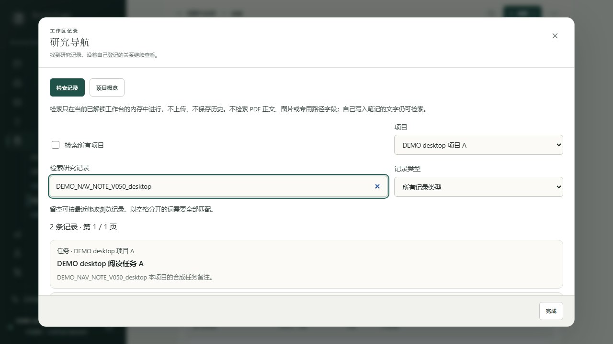
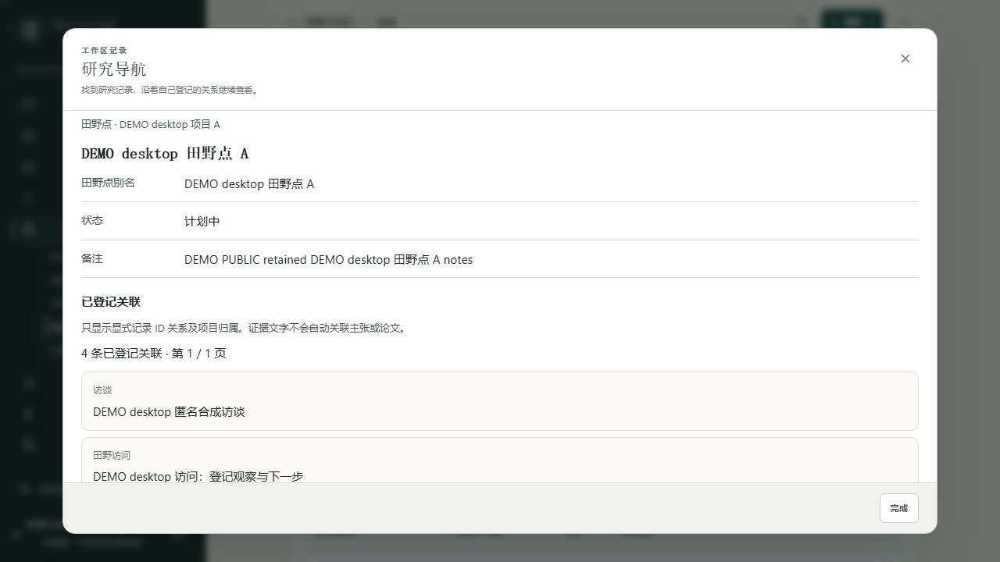
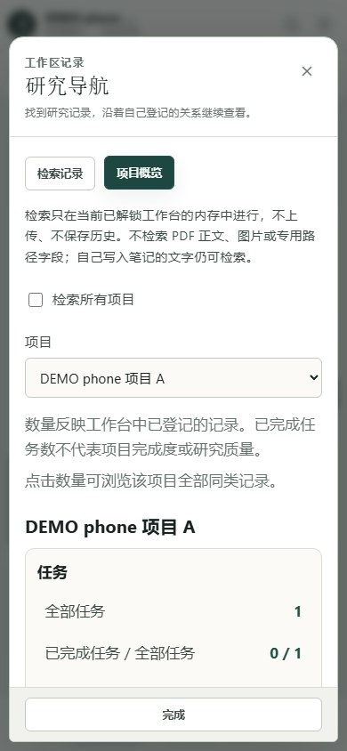

**简体中文** · [English](README.en.md)


# 社会学博士研究工作站

**把文献、田野、分析与写作安排在同一张研究桌上。**

面向社会学博士研究者的本地优先工作站。无需账号，中文优先并提供完整英文界面；浏览器即可使用，也可安装为 PWA。

**[打开工作站 →](https://yoesher.github.io/sociology-phd-desk/)** · **[发行版](https://github.com/Yoesher/sociology-phd-desk/releases)** · **[开始使用](docs/zh-CN/getting-started.md)** · **[0.5.0 更新说明](docs/releases/v0.5.0.md)**

`应用 0.5.0` · `数据格式 v7` · `本地优先` · `可离线使用`

**0.5.0：研究导航。** 桌面与手机的放大镜可检索17类研究记录，按项目与类型筛选，查看笔记详情和已登记关系；项目概览显示真实任务队列、问题与资料积累。查询只在当前已解锁工作台内存中运行，不保存历史、不上传。地图、田野点、访问与访谈可沿稳定ID互相回看；证据文字不会被猜成主张链接。**[完整修正方案与20工具比较](docs/research-workstation-review-2026-10-04.md)** · [使用说明](docs/releases/v0.5.0.md)

**保留0.4.1外观与动效。** 在“工作空间与设置 → 外观与动效”选择经典研究桌、暖纸阅读、静谧蓝调或田野手记界面模板，学术混排/现代黑体/阅读宋体/系统字体，标准/较大/更大字号，以及轻柔上浮/柔和淡入/轻微平移/关闭动画。默认保留旧外观，系统“减少动态效果”优先。偏好与语言、主题一起保存在当前浏览器；切换普通或加密工作台、锁屏与刷新共用，不进入研究数据或备份。模板只改变配色与版式，不填充研究内容。[更新与验收说明](docs/releases/v0.4.1.md)

[本地地图与备份指南](docs/local-field-maps-and-storage-2026-10-04.md) · [更新历史](CHANGELOG.md) · [实际验收记录](PROJECT_STATE.md)



*实际应用截图，只展示合成 DEMO。没有真实论文、实证结果或参与者资料。*

## 从阅读到修回，让研究对象彼此衔接

| 工作 | 现在可以做什么 |
| --- | --- |
| **研究导航** | 从当前或明确选定的全部项目检索17类记录；查看原文、已有稳定ID关系与实际项目队列。查询仅在内存中，所有结果与关联可翻页。 |
| **文献与 PDF** | 手动登记文献、查看与编辑记录、附加本地 PDF；PDF 上传与 Zotero 元数据导入使用独立入口。保存后显示完整的当前范围列表，失败时保留输入。 |
| **项目空间** | 选择项目后，研究模块显示相关记录，新记录自动归属当前项目。切换项目只改变显示；写入和备份保留整个工作台。今日目标是工作台共同目标。 |
| **任务与日期** | 查看实际截止日期、剩余或逾期天数及未来七天任务；重新编辑期限与备注，保留完成状态。打开的页面会在本地午夜、聚焦或恢复可见时刷新日期。 |
| **本地田野标注** | 导入自己有权使用的 PNG/JPEG 地图或草图，以图内百分比关联同项目田野点，查看关联访问与访谈。支持点击、键盘及百分比输入；移除标注不删除原记录。 |
| **私密工作台与备份** | 隔离多个本地工作台，可选择加密存储、锁定与 `.sociologydesk` 加密备份。普通和加密备份均包含所有项目、PDF、图像与标注。 |

应用连接研究问题、文献、数据集或访谈、分析、证据、主张、论文与修回工作；它补充 Zotero、Word、Stata、R、Python 和 NVivo 等专业工具。Evidence↔Claim↔Manuscript 的完整显式追踪仍是独立的 [Issue #2](https://github.com/Yoesher/sociology-phd-desk/issues/2)，各模块编辑/删除能力尚未完全一致。

## 看看工作台

以下是已上线 0.5.0 的真实界面，均在独立合成 DEMO 工作台中捕获。版本、完整构建 SHA、截图尺寸与隐私审阅见[截图登记](docs/screenshots/README.md)。

<table>
  <tr>
    <td width="70%" valign="top"><a href="docs/screenshots/v0.5.0/02-saved-relationships-zh.jpg"></a><br /><strong>沿记录关系回看研究</strong><br />查看原文与真实关联，连续浏览问题、主张和资料；编辑仍在原模块完成。</td>
    <td width="30%" valign="top"><a href="docs/screenshots/v0.5.0/03-mobile-overview-zh.jpg"></a><br /><strong>按实际记录安排下一步</strong><br />任务队列、问题与已标注田野点计数，不生成研究质量评分。</td>
  </tr>
</table>

以下保留 0.4.1 外观设置的实际界面。桌面与手机在各自浏览器记住偏好；这些截图同样只包含合成数据。

<table>
  <tr>
    <td width="70%" valign="top"><a href="docs/screenshots/v0.4.1/01-appearance-settings-zh.jpg"></a><br /><strong>选择自己的研究桌</strong><br />四种模板、四种字体、三档字号与四种动效，即时应用并记住选择。</td>
    <td width="30%" valign="top"><a href="docs/screenshots/v0.4.1/03-mobile-settings-zh.jpg"></a><br /><strong>手机也可调整</strong><br />控件保持可读，系统减少动态效果优先。</td>
  </tr>
</table>

点击图片查看原图。以下均为真实运行的 0.4.0 界面与合成演示记录；草图没有真实地理边界或参与者位置。拍摄版本、尺寸与隐私核查见[截图登记](docs/screenshots/README.md)。

<table>
  <tr>
    <td width="50%" valign="top">
      <a href="docs/screenshots/v0.4.0/03-field-maps-zh.jpg"></a><br />
      <strong>本地地图标注</strong><br />用自己的粗略素材，关联田野点与研究记录。
    </td>
    <td width="50%" valign="top">
      <a href="docs/screenshots/v0.4.0/02-literature-zh.jpg"></a><br />
      <strong>文献与 PDF</strong><br />登记、查看、编辑，附件随完整备份保存。
    </td>
  </tr>
  <tr>
    <td width="50%" valign="top">
      <a href="docs/screenshots/v0.4.0/04-deadlines-zh.jpg"></a><br />
      <strong>任务期限</strong><br />按实际日期安排工作，重新查看与修改任务。
    </td>
    <td width="50%" valign="top">
      <a href="docs/screenshots/v0.4.0/05-interface-en.jpg"></a><br />
      <strong>完整英文界面</strong><br />语言切换保留原研究文本、记录与关系。
    </td>
  </tr>
</table>

<details>
<summary>查看手机界面 · 390 × 844</summary>

<p>手机截图也只使用合成 DEMO；点击查看原图。</p>
<a href="docs/screenshots/v0.4.0/06-mobile-zh.jpg"></a>

</details>

## 三步开始

1. **打开网站，建立工作台。** 无需注册。先体验合成演示，再建立自己的普通或加密工作台；普通浏览器访问始终支持完整工作流。
2. **选好项目，登记研究记录。** 从文献、任务或田野点开始。本地草图是可选入口；没有地图也可以继续记录田野访问与访谈。
3. **生成并验证备份。** 使用 `.sociologydesk` 备份恢复到新的隔离工作台，以备份方式迁移设备。PWA 安装和本地保存不会自动产生第二份副本。

首次成功加载并缓存后，应用静态资源可离线启动。出现更新提示时，“稍后”保留当前版本；保存编辑、生成并验证备份后选择“立即更新”，再到帮助中心核对应用版本与构建身份。不要清除站点数据或重置工作台来更新。网页关闭后没有系统通知或后台期限推送。

## 附件容量与数据迁移

| 内容 | 当前边界 |
| --- | --- |
| 本地 PDF | 每个 **10 MiB**，整个工作台合计 **20 MiB**；点击下载时才解码。 |
| PNG/JPEG 图像 | 每个 **2 MiB**，整个工作台合计 **4 MiB**；单边最多 **8,192 像素**，总面积最多 **1,600 万像素**。 |
| 完整普通 JSON | **32 MiB**，包含所有项目、记录与 base64 附件；普通文件导入也在读取前检查此上限。 |
| 加密备份 | 沿用 **64 MiB 密文**上限及独立附件限额；认证标签和封装另有边界，不能当作无限容量。 |

1 MiB = 1,048,576 字节。Base64 和可读 JSON 有额外开销，附件分别未达上限也可能使完整普通 JSON 超限。导出和新的超限增长会明确拒绝，保留输入与原数据，不截断附件、不只备份当前项目。

已有合法超限工作台仍可完整读取、迁移和进行不增加序列化大小的写入；在原加密容量与附件约束内可用完整加密备份保全。更大量 PDF 需要后续独立附件存储与分块认证备份，目前未实现，请保留自己的原文件。

当前 portable workspace、标准数据库与 authenticated encrypted payload 为 **v7**；container、vault database、registry database 仍为 **v1**。v6 → v7 保留旧记录，只增加空的本地地图集合，不推断图片或坐标。旧版 0.3.1 不能读取 v7 备份；跨版本前保留并验证原版本备份。导入先验证预览，替换必须明确确认；加密恢复先认证、验证，再创建新的隔离工作台，口令错误或密文损坏不会写入目标。

完整流程见[本地地图与存储指南](docs/local-field-maps-and-storage-2026-10-04.md)和[数据迁移说明](docs/data-portability.md)。

## 本地优先，也认真对待研究隐私

**不要存储可直接识别参与者身份的信息。** 使用别名和匿名 ID，不录入姓名、电话、证件号码、精确住址、签名或完整知情同意书。

- 研究数据默认保存于当前浏览器配置文件的 IndexedDB，无账号、默认云同步、分析统计、第三方跟踪器或必需 AI API。不同工作台使用独立数据库，但处于同一 Web 来源的信任边界内。
- 标准工作台与普通 JSON 是明文。仅明确标为加密工作台或 `.sociologydesk` 备份的内容使用应用层加密；界面锁定不等于加密。工作台名称、时间、模式等注册表信息与大致存储大小仍可见。
- 数据集、脚本和输出路径只是引用，不读取文件内容；自选 PDF 和图像保存实际字节。本工具不是源数据、访谈全文或不可替代资料的安全保管库。
- 本地图像只能是有权使用的县域或更粗研究示意、或匿名公共场所，不包含参与者住宅、精确位置或身份信息。原始字节及可能存在的 **EXIF/GPS 不会自动清除**；图内百分比与别名不保证匿名、授权或地图审查合规。
- 不提供全国底图、省市县浏览、行政区目录、在线瓦片、外部地图 API、GPS 获取或地图图像公开导出。全国地图四项门禁仍为 **BLOCKED**；本地素材工具不完成或绕过这些门禁，也不自动上传素材、标注或研究记录。

浏览器存储可能被清除，设备可能损坏；加密无法保护已解锁会话或失陷设备，忘记口令且失去备份可能无法恢复。删除 IndexedDB 不是安全擦除。请维护并实际测试独立备份，遵守机构的伦理、知情同意、保留期限与数据保护要求。没有读取用户真实数据库，不能声称原先找不到的文献已恢复。

[安全政策](SECURITY.md) · [隐私与加密模型](docs/zh-CN/privacy-model.md) · [研究伦理](docs/research-workflows/research-ethics.md)

## Zotero 保持书目管理职责

Zotero 仍是书目、PDF、笔记、批注和引用的权威系统。在 Zotero 8/9 中选择文献并发送到工作站后，核对导入预览、项目、阅读状态和优先级，再确认写入。

插件 **0.1.0 只交接允许的书目元数据**，不读取或导入 PDF、附件、私有笔记、批注、全文、账号或同步信息。本地 PDF 由工作站独立选择；没有自动 PDF 元数据提取。

**[下载插件 0.1.0](https://github.com/Yoesher/sociology-phd-desk/releases/download/v0.3.0/sociology-phd-desk-zotero-0.1.0.xpi)** · [SHA-256 校验文件](https://github.com/Yoesher/sociology-phd-desk/releases/download/v0.3.0/sociology-phd-desk-zotero-0.1.0.sha256) · [安装与使用](docs/zh-CN/zotero-integration.md)

插件继续使用既有 v0.3.0 正式资产，此应用更新不代表新增插件发行。

## 九个研究工作域，一条研究生命周期

| 工作域 | 用途 |
| --- | --- |
| 今日工作台 / 研究项目 | 共同目标、任务、研究问题、方法与项目进展。 |
| 文献队列 / 理论研究 | 阅读用途、PDF、概念、机制和理论 memo，与同项目问题、主张、文献关联。 |
| 田野与访谈 / 定量分析 | 别名田野点、访问、访谈与可选草图；数据集和 Stata/R/Python 分析运行。 |
| 证据台账 / 研究日志 | 来源定位、发现、局限、支持程度，以及研究判断与下一步。 |
| 论文与投稿 | 写作阶段、投稿、审稿意见、回复与修回行动，保留各实体和历史。 |

React、TypeScript、Vite 构建界面；Dexie 管理 IndexedDB，Zod 验证可迁移数据，Web Crypto 提供可选认证加密。界面语言与研究工作台分开保存，切换中英文不改写标题、笔记或其他用户文本。没有账号、云同步、通用 AI 助手或地图服务。

[架构](docs/architecture/overview.md) · [数据模型](docs/architecture/data-model.md) · [设计决定](DECISIONS.md) · [路线图](ROADMAP.md)

## 开发与贡献

已验证的开发环境为 **Node.js 24 / npm 11**。使用启用 IndexedDB 的现代浏览器；实际浏览器测试覆盖与版本验收以[项目状态](PROJECT_STATE.md)为准。

```bash
git clone https://github.com/Yoesher/sociology-phd-desk.git
cd sociology-phd-desk
npm ci
npm run dev
```

打开 Vite 显示的本地地址。不同浏览器配置文件或设备不会自动共享记录。完整发布检查使用以下原始命令；Playwright 需要相应 Chromium 浏览器运行环境。

```bash
npm ci
npm run audit:release
npm run lint
npm run typecheck
npm test
npm run test:zotero
npm run build
npm run test:e2e
```

只有当前修订上实际成功的检查才能报告通过。Zotero 构建可能生成哈希文件；核对生成变化，不要把本地重打包哈希当作既有正式下载资产的哈希。

[贡献指南](CONTRIBUTING.md) · [行为准则](CODE_OF_CONDUCT.md) · [研究者反馈表](https://github.com/Yoesher/sociology-phd-desk/issues/new?template=researcher_testing_feedback.yml)

反馈只附合成或完整脱敏材料，不附参与者信息、私密田野笔记、访谈文本、凭据或专有数据。项目活动与采用情况只在可核验时报告；维护者自测、公开可用或 Star 不代表外部研究者采用。证据见[项目诚信登记](docs/codex-for-oss.md)，维护者见 [MAINTAINERS.md](MAINTAINERS.md)。

## 引用与许可证

研究中使用本软件时，请引用 **Sociology PhD Desk 及所用的准确应用版本**；机器可读信息见 [CITATION.cff](CITATION.cff)。发行记录与历史变化见[发行版](https://github.com/Yoesher/sociology-phd-desk/releases)和 [CHANGELOG.md](CHANGELOG.md)。

Sociology PhD Desk 使用 [MIT License](LICENSE)。
